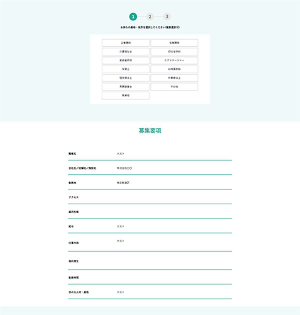
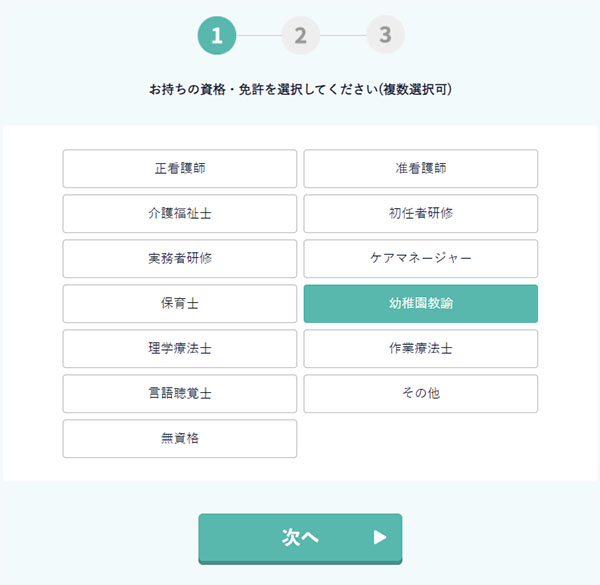
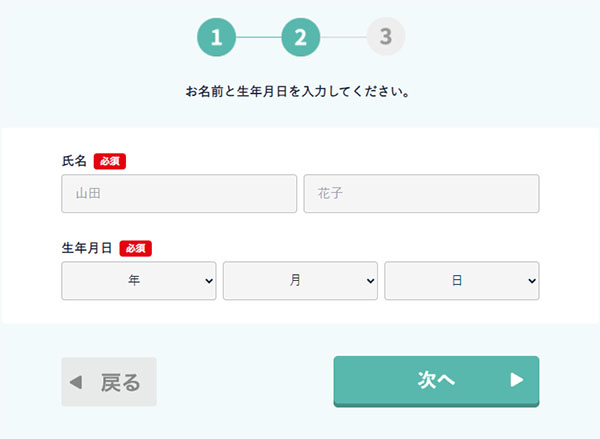
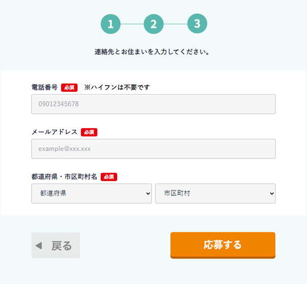
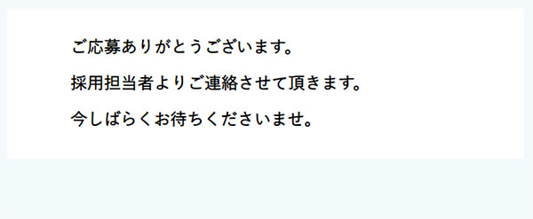

# boshu-lp概要

職種を選択して応募できる応募者向けのサイト

参考用プロトタイプ:

<https://ih-cloud.click/vi-vi-d/12819343559294925497570007086965129462>
<https://www.figma.com/file/EtWmRwG6Qu3tyTB3tAMcCc/%E5%8B%9F%E9%9B%86LP>

## 技術要件

- 言語とフレームワーク: NextJS + TypeScript + Tailwind CSS
- 実装環境: AWS (DynamoDB、Lambda関数等)
- レスポンシブ対応
  - PCとSPでの閲覧と操作が可能
  - SPレイアウトはPCレイアウトを縮小して悪く見えない程度に対応

## レイアウト

- メインのエリアはマルチステップの入力フォーム
- 4つのステップでユーザーに個人情報入力から応募まで誘導
- 各ステップにはユーザーからの入力があり、その入力チェックが行われる
- 「募集要項」を含むフォームの外部は静的であり、特定の操作がない
- 「募集要項」は説明情報を表す簡単なテーブル形式

---

# 入力ステップ1

## インプット
- ユーザーが職種・資格を選択

## アウトプット
- なし

## 入力チェック
- 複数の職種・資格を選択可能
- 未選択の場合、「資格を選択してください」を表示

## ボタンとアクション
- 「次へ」ボタン: 入力が妥当であればステップ2に進む

## 表示
- 進捗と現在のステップ番号をアクセントカラーで表示
- 選択済の職種・資格をアクセントカラーで表示

---

# 入力ステップ2

## インプット
- ユーザーが氏名（性と名）、生年月日を入力

## アウトプット
- なし

## 入力チェック
- 氏名（性と名）と生年月日は必須項目
- 性または名が空白の場合、「氏名を入力してください」を表示
- 生年月日のどれかが空白の場合、「生年月日を選択してください」を表示

## ボタンとアクション
- 「戻る」ボタン: ステップ1に戻る
- 「次へ」ボタン: 入力が妥当であればステップ3に進む

## 表示
- 進捗と現在のステップ番号をアクセントカラーで表示
- 氏名と生年月日の右にそれぞれ「必須」ラベルを表示

---

# 入力ステップ3

## インプット
- ユーザーが電話番号、メールアドレス、都道府県・市区町村名を入力

## アウトプット
- なし

## 入力チェック
- 電話番号、メールアドレス、都道府県・市区町村名は必須項目
- 電話番号が11桁の数列でない場合、「電話番号を正しい形式で入力してください (ハイフン無しの11桁)」を表示
- メールアドレスがメールアドレスの形式でない場合、「メールアドレスを正しい形式で入力してください」を表示
- 都道府県・市区町村名が未選択の場合、「都道府県を選択してください」か「市区町村を入力してください」を表示

## ボタンとアクション
- 「戻る」ボタン: ステップ2に戻る
- 「応募する」ボタン: 入力が妥当であれば：
  - ユーザーがステップ3まで入力したデータ（選択済の職種・資格、氏名（性と名）、生年月日、電話番号、メールアドレス、都道府県・市区町村名）をデータベースに更新処理
  - ステップ4に進む

## 表示
- 進捗と現在のステップ番号をアクセントカラー（具体的なカラーコード）で表示
- 電話番号、メールアドレス、都道府県・市区町村名の右にそれぞれ「必須」ラベルを表示
- 選択した都道府県に対応する市区町村名一覧を表示

---

# 入力ステップ4

## インプット
- なし

## アウトプット
- なし

## 入力チェック
- なし

## ボタンとアクション
- なし

## 表示
- 応募処理が完了し、ユーザーに感謝メッセージを表示

